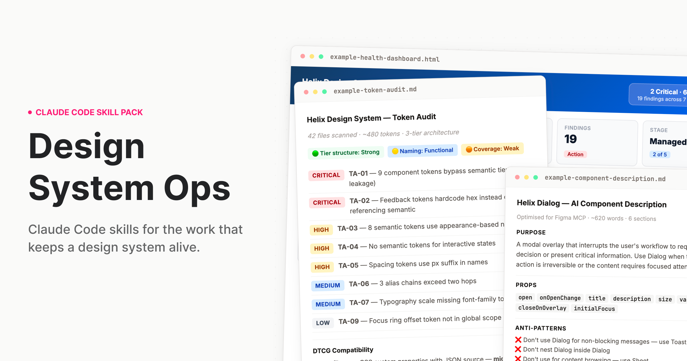

# Design System Ops



Claude Code skills for the work that keeps a design system alive.

[designsystemops.com](https://designsystemops.com)

[](https://github.com/murphytrueman/design-system-ops/actions/workflows/ci.yml)

---

## The work nobody built AI for

Design systems drift. Tokens go stale. Components fall out of spec. Governance documentation gets written once and never updated. The deprecation plan lives in someone's head. The stakeholder brief gets thrown together the night before quarterly review.
There are great AI tools for the designer who uses a design system. But the team running it? That work never had proper tooling – until now.

---

## What this is

A skill pack for [Claude Code](https://docs.anthropic.com/en/docs/claude-code) and [Cowork](https://claude.ai) that teaches Claude how to do design systems work the way a staff-level practitioner would — with structured processes, expert frameworks, and output calibrated to the actual complexity of what you're dealing with.

When you ask Claude to audit your tokens, it doesn't give you generic advice. It reads your actual token files, identifies tier leakage, flags naming violations, and produces a prioritised finding table with remediation guidance and effort ranges you can plan sprints around. If you're moving to DTCG, it can plan that migration too.

That is the difference. Not a smarter prompt. A different kind of output entirely.

**Who it's for:** Design systems leads, senior design engineers, and anyone responsible for a production design system. The people who run the system, not just the people who use it.

---

<a id="install"></a>

## Installation

### Cowork (desktop app — easiest)

1. Download `design-system-ops.plugin` from the [`installable/`](installable/) folder — or from the [latest Release](https://github.com/murphytrueman/design-system-ops/releases/latest)
2. Open the Claude desktop app and start a Cowork session
3. Drop the `.plugin` file into the chat
4. Follow the install prompt — done

### Claude Code (terminal)

Clone this repo into your Claude Code skills directory:

```bash
git clone https://github.com/murphytrueman/design-system-ops.git ~/.claude/skills/design-system-ops
```

For project-level installation (instead of global):

```bash
git clone https://github.com/murphytrueman/design-system-ops.git your-project/.claude/skills/design-system-ops
```

Claude Code loads the cloned folder as a plugin. To confirm, run `claude plugin list`: you should see `design-system-ops@skills-dir` with status loaded. A project-level install only loads once you trust the project folder; accept Claude Code's trust prompt, then run `/reload-plugins`.

**Verify:** Open Claude Code and say "How healthy is my design system?" If Claude responds with a structured, multi-step process — not generic advice — you're set up.

To check the install itself, run `bash ~/.claude/skills/design-system-ops/verify-install.sh` — it confirms every skill can find its knowledge notes. Only git clone and the `.plugin` bundle are supported; installers that flatten skills into separate folders (e.g. `npx skills install`) drop the knowledge notes, and skills will stop and tell you so.

See [1-INSTALL.md](1-INSTALL.md) for the full guide with entry points by use case.

---

## What's included

### Skills

| Category | Skills | What they do |
|----------|--------|-------------|
| **Audit** | token-audit, component-audit, system-health, drift-detection, naming-audit, figma-variable-audit, codebase-index, theme-audit, docs-coverage | Understand what you actually have |
| **Govern** | contribution-workflow, deprecation-process, decision-record, change-communication, backlog-generator, version-bump-advisor, release-retrospective, governance-encoder, codemod-generator | Run the system as infrastructure |
| **Document** | ai-component-description, pattern-documentation, token-documentation, usage-guidelines, component-decision-tree, agent-instructions, metadata-schema-generator | Make the system legible to humans and machines |
| **Validate** | design-to-code-check, accessibility-per-component, token-compliance, schema-validator, component-api-validator, cicd-integration | Verify quality before it ships |
| **Communicate** | adoption-report, stakeholder-brief, system-pitch, onboarding, visual-report | Move people and decisions |

### Agents

Run these as slash commands. Claude Code prefixes plugin commands with the pack's name, so type `/design-system-ops:` to see them all.

| Agent | What it chains | When to use it |
|-------|---------------|----------------|
| `/design-system-ops:full-diagnostic` | 6 audit skills (+ conditional theme/Figma) with cross-skill synthesis | Quarterly review or inheriting a system |
| `/design-system-ops:release-check` | Design-to-code, accessibility, token compliance, AI description, usage guidelines, change communication (plus a semver check for breaking changes) | Before shipping any component |
| `/design-system-ops:governance-review` | Adoption report, drift detection, stakeholder brief | Monthly or quarterly governance cadence |
| `/design-system-ops:token-migration` | Token audit, transformation table, codemods, a three-stage rollout (ship new names with the old ones aliased and deprecated, consumers migrate, remove in the next major), communication | Planning a token migration (format, tool, naming or tier) |

### For coding agents

`agent-instructions` writes the `AGENTS.md` that Claude, Cursor and Copilot read first, with a source for every rule, and links the rest: the inventory and dependency graph from `codebase-index`, per-component metadata from `metadata-schema-generator`, choosing-between pages from `component-decision-tree`, and the lint configuration `governance-encoder` writes so agents can check their own work.

---

## Core frameworks

The skills encode specific practitioner frameworks, not generic advice:

- **Three-tier token architecture** — primitive → semantic → component, with tier-leakage detection and DTCG 2025.10 alignment
- **Component Challenge Rating** — rates components by how risky they are to implement, so higher-risk components get deeper documentation and more rigorous validation
- **Design system maturity model** — five named stages from Ad-hoc to Optimised, used across health reports, stakeholder briefs, and adoption tracking to frame recommendations appropriately
- **AI-readiness assessment** — evaluates how well your system's metadata, naming, and structure support AI agent consumption

---

<a id="quick-examples"></a>

## Usage

**"I just want to know where we stand"**
→ Say: "How healthy is my design system?"

**"Our tokens are a mess"**
→ Say: "Audit my tokens"

**"I need to deprecate a component"**
→ Say: "Help me deprecate DatePicker in favour of DatePickerNext"

**"I need to convince leadership to fund this"**
→ Say: "Help me build the business case for a dedicated design system team"

**"My VP wants an update"**
→ Say: "Write a short update for our VP on where the design system stands this quarter"

**"Run the full pre-release pipeline"**
→ Run: `/design-system-ops:release-check Dialog`

### Which skill do I need?

| If you're asking… | Start with |
|---|---|
| Where do we stand overall? | `system-health` |
| Are the tokens defined well? / Is the code using them? / Do the themes match? | `token-audit` / `token-compliance` / `theme-audit` |
| Are the token files valid? | `schema-validator` |
| What components do we have, and what's duplicated or missing? | `component-audit` |
| Does this component match its design? / Is it accessible? | `design-to-code-check` / `accessibility-per-component` |
| Where are teams drifting off the system? | `drift-detection` (needs a consuming codebase) |
| Which components are undocumented or stale? | `docs-coverage` |
| How do I remove or replace something? | `deprecation-process`, then `change-communication` |
| Is this release a major? | `version-bump-advisor` |
| How do I make coding agents use the system properly? | `agent-instructions`, then `codebase-index` and `metadata-schema-generator` |
| Someone new starts next week | `onboarding` |
| Leadership wants an update / wants a business case | `stakeholder-brief` / `system-pitch` |

You don't need to memorise skill names. Describe what you need and the right skill activates. You can also run any skill directly, with a path if you like: `/design-system-ops:token-audit src/tokens`. The four chained workflows are the exception to asking in plain language: run them by their command, so a long multi-skill run only starts when you ask for it.

---

## Sample outputs

Sample outputs are in [`sample-outputs/`](sample-outputs/). `docs-coverage-carbon-react.md` is an unedited run against a real public codebase. The rest began as runs against real systems and have since been anonymised and edited to match the pack's current output rules, so treat them as a guide to depth and format rather than as records of a specific system.

- **[example-token-audit.md](sample-outputs/example-token-audit.md)** — A complete audit of a ~480 token system: 11 findings across Critical/High/Medium/Low, specific code examples, DTCG alignment assessment, and a prioritised remediation roadmap.
- **[example-component-description.md](sample-outputs/example-component-description.md)** — A six-section MCP description for a React Dialog component: ~690 words of structured plain text for Figma, within the skill's 400–700 word range.
- **[example-health-dashboard.html](sample-outputs/example-health-dashboard.html)** — An interactive HTML dashboard generated from audit findings: health radar, severity distribution, priority matrix, metric cards. Open in any browser.
- **[docs-coverage-carbon-react.md](sample-outputs/docs-coverage-carbon-react.md)** — A docs-coverage audit run against a real public Storybook (IBM Carbon's React build): coverage-by-rung, git-based staleness findings with both change dates, and the "37 undocumented → 5 real candidates" triage that keeps the skill from crying wolf. Every finding carries a join-confidence tier.

Five `fixture-*` samples are unedited runs against the small test design system in `tests/fixtures/`, so you can see exactly what the skills produce and regenerate them yourself with the evals. The folder also holds system-health, component-audit, drift-detection and stakeholder-brief samples — [2-WHATS-INCLUDED.md](2-WHATS-INCLUDED.md) lists all thirteen.

---

## Configuration

Every skill works out of the box with no configuration. If you want to customise behaviour — severity overrides, Figma integration, GitHub API access, recurring trend tracking — copy the annotated template, [`ds-ops-config.example.yml`](ds-ops-config.example.yml), to your project root as `.ds-ops-config.yml`. It documents every key the skills read.

See [3-SETUP-AND-CONFIG.md](3-SETUP-AND-CONFIG.md) for the full configuration reference.

---

## Figma integration (optional)

Several skills become more powerful when Claude can read your Figma file directly. Two options:

- **[Figma Console MCP](https://github.com/southleft/figma-console-mcp)** (recommended) — Read and write access. Skills can write descriptions back into components, rename variables, create tokens.
- **[Official Figma MCP](https://help.figma.com/hc/en-us/articles/32132100833559-Guide-to-the-Figma-MCP-server)** — Reads are scoped to your current selection, and it can write through its `use_figma` tool. Skills pull component data and the variables a selection uses; collection-wide variable audits need the Console MCP.

Setup details in [1-INSTALL.md](1-INSTALL.md#setting-up-figma-integration).

---

## Requirements

- [Claude Code](https://docs.anthropic.com/en/docs/claude-code) or [Cowork](https://claude.ai) (Claude desktop app)
- Access to your design system's source files (tokens, components, config)
- Works with any stack: React, Vue, Twig, Tailwind, SCSS, CSS custom properties, Style Dictionary, Emotion, CSS-in-JS

---

## Documentation

| File | What it covers |
|------|---------------|
| [1-INSTALL.md](1-INSTALL.md) | Full installation guide with entry points by use case |
| [2-WHATS-INCLUDED.md](2-WHATS-INCLUDED.md) | Complete product documentation — every skill, agent, and knowledge note |
| [3-SETUP-AND-CONFIG.md](3-SETUP-AND-CONFIG.md) | Deep-dive setup, framework compatibility, monorepo handling, troubleshooting |
| [CHANGELOG.md](CHANGELOG.md) | What changed in each release, and why |

---

## Contributing

See [CONTRIBUTING.md](CONTRIBUTING.md).

Run the test suite before opening a pull request:

```bash
./tests/run.sh
```

Stdlib Python, nothing to install. It checks skill frontmatter and references, that every count and config key the docs mention matches the files, that commands pre-approve the tools their skills use, that no output template asks for a numeric score, and that the built plugin bundle is complete and installs cleanly. CI runs the same suite on every pull request.

Before a release, `python3 tests/evals/run_evals.py` runs key skills against a small design system with known problems planted in it and checks they find them. It calls Claude, so it isn't part of CI — see [tests/README.md](tests/README.md).

---

## License

MIT — see [LICENSE](LICENSE).

---

## Support

If you found this useful, [buy me a coffee](https://buymeacoffee.com/murphytrueman).

---

## Author

**Murphy Trueman** — [designsystemops.com](https://designsystemops.com) · [hello@murphytrueman.com](mailto:hello@murphytrueman.com)

Built from 14 years of production design systems work. If it's in these skills, it's because it came up in real work.
