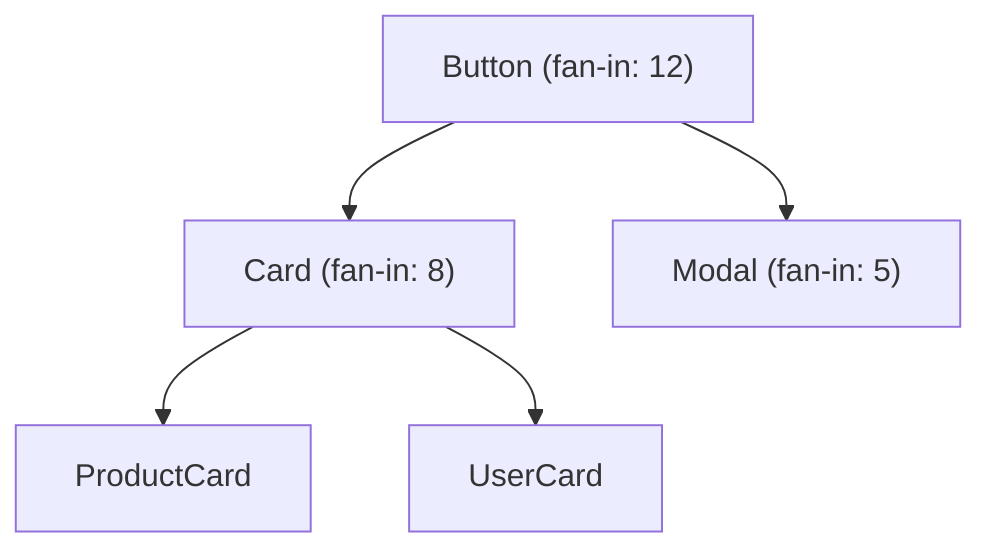

# Visual Report

A skill for transforming audit findings, system health statuses, and saved recurring runs into visual outputs — interactive HTML dashboards, SVG charts, and Mermaid diagrams — that make design system health visible at a glance.

**Output type:** File creation. This skill produces HTML dashboard files, SVG chart files, or Mermaid diagram blocks that can be embedded in documentation, presentations, or shared directly.

---

## Before you begin: verify references

Confirm that every path in this skill's frontmatter `references:` exists relative to this SKILL.md. If any is missing, stop: the install is incomplete, usually because a flattening installer (for example `npx skills install`) dropped the repo-root `knowledge-notes/` directory. Tell the user to reinstall by a method in `1-INSTALL.md` and run `verify-install.sh` from the install root. Proceed without the references only if the user explicitly says to, and then say in the output that it was produced without the pack's reference material.

## Why this exists

Numbers in a markdown table are accurate. They are also invisible. A stakeholder will not register "System health: 🟡 Functional with two weak dimensions" from a text report. But a radar chart showing dimension statuses — with red zones, amber zones, and green zones — communicates instantly.

Design system health data is inherently visual. Token coverage maps, component dependency graphs, severity distribution pie charts, trend lines over time — these are the natural representations of the data that audit skills produce. This skill bridges the gap between raw findings and visual communication.

## Boundaries

This skill visualises existing findings — it does not run audits or generate new data. If no audit output or session history exists, there is nothing to visualise; run the relevant audit skill first. If the request is for a written stakeholder summary rather than a visual artefact, use `stakeholder-brief` instead. This skill produces HTML dashboards, SVG charts, and Mermaid diagrams — if the request is for a slide deck or PDF, the visual output from this skill can feed into those formats but this skill does not produce them directly.

---

## Configuration

If `.ds-ops-config.yml` exists, follow the configuration-and-recurring knowledge note (`../../knowledge-notes/configuration-and-recurring.md`) for loading, integration fallbacks and recurring runs. This skill reads:

```yaml
visuals:
  brand_primary: "#0052CC"           # Primary colour for charts
  brand_secondary: "#FF5630"         # Accent colour for warnings/critical
  brand_success: "#36B37E"           # Success colour
  brand_neutral: "#6B778C"           # Neutral/baseline colour
  output_format: "html"              # html, svg, or mermaid
  output_directory: ".ds-ops/visuals"
```

If no configuration exists, use these defaults:
- Primary: `#2563EB` (blue)
- Secondary: `#DC2626` (red)
- Success: `#16A34A` (green)
- Neutral: `#6B7280` (grey)
- Output format: `html`
- Output directory: `.ds-ops/visuals` (the same as the config default, so a run with and without a config file lands in the same place)

---

## Input formats

This skill accepts any of these as input:

1. **Raw skill output** — Copy-pasted or referenced output from any audit skill
2. **Saved reports** — previous runs in `recurring.output_directory`, for trend lines
3. **System health statuses** — The dimension statuses from system-health
4. **Comparison data** — the trend section a recurring run adds to its report
5. **Manual data** — User-provided metrics in any format (will be normalised)

---

## Step 0: Determine the visual type

Based on the input data and the request, select one or more visual types:

### Visual types available

| Type | Best for | Format |
|---|---|---|
| **Status strip** | System health dimension statuses | One tile per dimension, coloured by status |
| **Severity distribution** | Audit findings by severity | Donut chart |
| **Trend line** | Metric changes over time | Line chart |
| **Coverage heatmap** | Token or component coverage | Grid heatmap |
| **Dependency graph** | Component relationships | Mermaid flowchart |
| **Comparison bar** | Before/after comparisons | Grouped bar chart |
| **Action priority matrix** | Findings by effort vs. impact | Scatter plot |
| **Full dashboard** | Multiple visuals on one page | HTML dashboard |

If the request is vague ("make this visual"), choose the visual type that best fits the data:

- System health statuses → Status strip
- Audit findings → Severity distribution + action priority matrix
- Session history → Trend line
- Before/after data → Comparison bar
- Multiple data types → Full dashboard

---

## Step 1: Parse and normalise the data

### From audit output
Extract:
- Finding IDs, severities, categories
- Metric totals (violation counts, coverage percentages)
- Component names (for dependency graphs)
- Token tiers (for coverage heatmaps)

### From saved recurring runs
Extract:
- Dates and skill names
- Key metrics per run (aligned for trend lines)
- Deltas between runs, from each report's trend section

### From system health
Extract:
- The dimension statuses the report has (system-health has seven; don't assume, read them)
- Overall health status
- Maturity stage

### Normalise all data into simple structures:

```
metrics: [{ label, value, max, category }]
timeseries: [{ date, metric, value }]
findings: [{ id, severity, category, effort?, impact? }]   # effort and impact only when the source report carries them
relationships: [{ source, target, weight }]
```

---

## Step 2: Generate the visuals

### Status strip

Produce one tile per dimension, in the report's order, each carrying the dimension name, the status word and the status colour (🟢 Strong, 🟡 Functional, 🟠 Weak, 🔴 Absent), plus the key finding as a one-line caption. Statuses are ordinal labels, so a strip reads honestly; a radar chart over them implies a magnitude and an area that the labels don't have. If the user asks for a radar anyway, produce it with the status words on the axes and say in the caption that the shape is illustrative.

Implementation: an HTML flex row of cards, or an SVG row of rectangles.

### Severity distribution chart

Produce a donut chart showing the distribution of findings by severity.

Ring segments use the four severities from output-discipline only, ordered darkest (Critical) to lightest (Low) so the order still reads in greyscale. Each colour has at least 3:1 contrast against a white background, and every segment carries a text label:
- Critical: Dark red (`#991B1B`)
- High: Orange (`#C2410C`)
- Medium: Amber (`#C27C0E`)
- Low: Grey (`#6B7280`)

Use the same four colours wherever severity appears (bubble charts, stacked bars, badges). Brand colours from configuration apply to non-severity series only.

Centre text: Total finding count.

Implementation: Chart.js doughnut, or SVG arc paths.

### Trend line chart

Produce a line chart with time on the X axis and the metric on the Y axis. One line per metric being tracked.

Include:
- Data points marked with circles
- Hover tooltips with exact values
- A target line if configured
- Positive/negative trend annotation

Implementation: Chart.js line chart in HTML.

### Coverage heatmap

Produce a grid where:
- Rows = token categories or component areas
- Columns = coverage dimensions (primitive, semantic, component, documented, tested)
- Cells = colour-coded by coverage status (green = covered, amber = partial, red = missing, grey = not applicable)

Implementation: HTML table with CSS background colours, or SVG grid.

### Dependency graph

Produce a Mermaid flowchart showing component relationships:



Colour nodes by health status if data is available. Use line thickness to indicate dependency weight.

Implementation: Mermaid.js syntax block.

### Comparison bar chart

Produce grouped bars showing before/after values for each metric. One group per metric (e.g., violations, critical count, coverage %).

Colour coding:
- Improved metrics: Green bars (after < before for violations; after > before for coverage)
- Worsened metrics: Red bars
- Unchanged metrics: Grey bars

Include delta labels above each bar group: "↓ 33%" or "↑ 5%"

Implementation: Chart.js grouped bar chart in HTML.

### Action priority matrix (only with sourced effort and impact)

Plot it only when every finding it would show carries an effort value and an impact value from the source report: effort from an estimates table the audit produced with its assumptions (token-audit's, for example), impact from the finding's severity. If the source has no effort figures, skip the matrix and say so in the text summary. Never assign effort to a finding to make the chart possible; an invented "8–12 hrs" on a dashboard becomes a sprint commitment.

Produce a scatter plot where:
- X axis = Effort (Low → High)
- Y axis = Impact (Low → High)
- Each dot = one finding, sized by severity
- Quadrants labelled: "Quick wins" (low effort, high impact), "Strategic investments" (high effort, high impact), "Fill-ins" (low effort, low impact), "Consider carefully" (high effort, low impact)

Implementation: Chart.js scatter chart with quadrant overlays in HTML.

### Full dashboard

Combine multiple charts into a single HTML page with:
- A header showing system name, date, and overall health status
- A headline sentence under the header: how worried the reader should be and what to look at first, taken from the source report's opening
- A grid layout (2 columns on desktop, 1 column on mobile)
- Charts sized proportionally
- A summary section at the top with 3–5 key metric cards
- An interactive filter (if saved recurring runs are present): dropdown to switch between runs
- A Scope block at the foot: what the source findings inspected, what they did not ("Not inspected"), and which figures were reported rather than measured — carried over from the source report

Implementation: a single HTML file with all data inline. Chart.js is the one dependency; `chart.js@4` on a CDN floats to the latest 4.x and fails offline or under a strict content-security policy, so either inline the library (read `node_modules/chart.js/dist/chart.umd.js` if the project has it) or pin the exact version (`npm view chart.js version`) with an `integrity` attribute, and say which in the footer.

---

## Step 3: Build the HTML dashboard (for full dashboard mode)

The dashboard is a single HTML file. Structure:

```html
<!DOCTYPE html>
<html lang="en">
<head>
  <meta charset="UTF-8">
  <meta name="viewport" content="width=device-width, initial-scale=1.0">
  <title>[System Name] — Design System Health Dashboard</title>
  <script src="https://cdn.jsdelivr.net/npm/chart.js@[exact version]/dist/chart.umd.min.js" integrity="[sri hash]" crossorigin="anonymous"></script>
  <!-- or inline the library so the file works offline -->
  <style>
    /* Inline styles — no external CSS */
    /* Use CSS Grid for layout */
    /* Responsive: 2 columns above 768px, 1 column below */
    /* Cards with subtle shadows for key metrics */
    /* Colour variables from config or defaults */
  </style>
</head>
<body>
  <header>
    <!-- System name, date, overall health status badge -->
  </header>
  <p class="headline">
    <!-- One-sentence headline from the source report -->
  </p>
  <section class="metrics-cards">
    <!-- 3–5 key metric summary cards -->
  </section>
  <section class="charts-grid">
    <!-- Individual chart containers -->
  </section>
  <section class="scope">
    <!-- Scope: Inspected / Not inspected / reported-not-measured, from the source report -->
  </section>
  <footer>
    <p>Generated by Design System Ops — visual-report</p>
    <p>[Date]</p>
  </footer>
  <script>
    // All chart configuration inline
    // Data embedded as JS objects
    // Chart.js instantiation for each chart
  </script>
</body>
</html>
```

### Key metric cards

Each card shows:
- Metric label (e.g., "Total violations")
- Current value (large font)
- Delta from previous session (if available, with arrow and colour)
- Sparkline trend (if 3+ data points available)

### Responsive behaviour

- Desktop (>768px): 2-column grid for charts, 3–5 cards in a row
- Tablet (768px): 2-column grid for charts, cards wrap to 2 per row
- Mobile (<768px): Single column, cards stack vertically

### Colour accessibility

- Never rely on colour alone to convey meaning
- Use patterns (dashed lines for targets, solid for actuals)
- Use labels on all chart segments
- Ensure contrast ratio ≥ 4.5:1 for all text
- Include a text-based summary below each chart for screen readers

---

## Step 4: Output

### For HTML dashboard
Save the file to the configured output directory:
`[output_directory]/[system-name]-dashboard-[YYYY-MM-DD].html`

### For individual charts (SVG)
Save each chart as a separate SVG file:
`[output_directory]/[chart-type]-[YYYY-MM-DD].svg`

### For Mermaid diagrams
Output the Mermaid syntax block inline in the conversation (for embedding in markdown documentation).

### For all formats
Also output a text-based summary of what the visuals show, so the findings are accessible without viewing the visual output:

```
Dashboard generated: agds-dashboard-2026-03-09.html

What the visuals show:
- Status strip: Strongest in Tokens (🟢 Strong), weakest in Documentation (🟠 Weak)
- Severity distribution: 12 findings — 2 Critical, 4 High, 4 Medium, 2 Low
- Trend: Violations decreased 33% since January
- Coverage: Feedback token category has zero coverage across all tiers
- Priority matrix: skipped, the source report carries no effort figures
```

---

## Integration with other skills

### As a follow-up to any audit skill
After any audit completes, suggest: "Run `visual-report` to generate charts from these findings."

### As part of the full-system-diagnostic agent
The diagnostic agent can chain visual-report after Phase 4 to auto-generate a dashboard from the full diagnostic output.

### As a companion to stakeholder-brief
When generating a stakeholder brief, suggest: "Run `visual-report` first and attach the dashboard to the brief."

### With recurring runs
Load the saved reports in `recurring.output_directory` to produce trend lines across runs; the configuration-and-recurring note says how they're matched.

---

## Quality checks

- Every value traces to a finding or figure in the input; missing data is shown as missing, never interpolated or estimated to complete a chart
- The dashboard opens with a headline sentence and ends with a Scope block that includes "Not inspected"
- Severity uses the four output-discipline levels only, in the colours above
- Uses only widely supported HTML, CSS and JavaScript
- No external dependencies beyond Chart.js, inlined or pinned to an exact version with an integrity hash
- The priority matrix appears only when the source report supplied effort and impact for every plotted finding
- Colours pass WCAG AA contrast ratios
- Text summaries accompany every visual
- Dashboard is responsive across desktop, tablet, and mobile
- Data embedded inline — no external data fetches
- File saved to correct directory with correct naming convention
- Mermaid diagrams use valid syntax that renders in GitHub, GitLab, and Notion
- Provenance marker present: "Generated by Design System Ops — visual-report"
